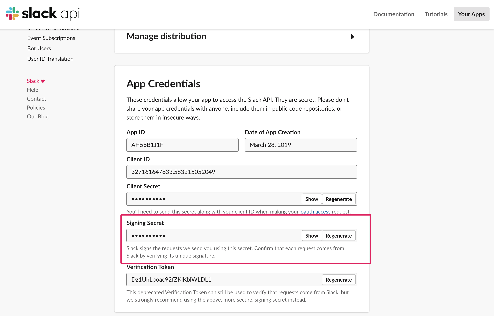

# Developing Slack apps locally

This tutorial is meant to guide developers through setting up and configuring a Slack app for local development.

Feel free to skip around to the specfic sections relevant to you — we won't mind 🙂

- [Create an app](#create-an-app)
- [Tokens and installing apps](#tokens-and-installing-apps)
- [Setting up interactive components](#setting-up-interactive-components)
  - [What is a Request URL?](#what-is-a-request-URL)
  - [Using a local Request URL for development](#using-a-local-request-URL-for-development)
  - [Add Request URL to your app configuration](#add-the-URL-to-your-app-configuration)
- [Listening to workspace events](#listening-to-workspace-events)
  - [Verifying your local endpoint](#verifying-your-local-endpoint)
  - [Adding event subscriptions](#adding-event-subscriptions)
- [Next steps](#next-steps)


## Create an app
First thing's first: before you start developing a Slack app, you'll need to [create an app](https://api.slack.com/apps/new). After you fill out an App Name (_you can change it later_) and picking a workspace to install it to, hit the `Create App` button and you'll be transported through space and time to the **Basic Information** page.

This page contains links to add features and functionalities to your app as well as important credentials you'll need for development later, like the `Signing Secret` under **App Crendentials**.


Look around, add an app icon and description, and then let's start configuring your app 🔩

## Tokens and installing apps
You have two major options for tokens: user (`xoxp`) tokens and bot (`xoxb`) tokens. User tokens allow you to call Web API methods on behalf of users based on OAuth scopes and bot tokens require a bot user, which has permissions by default similar to a standard user.

You can learn more about the different token types [on our API site](https://api.slack.com/docs/token-types). The type of token your app needs depends on the actions you want it to perform. But for brevity, we're going to use bot tokens for this guide.

To add a bot user, click **Bot Users** on the left sidebar and then **Add A Bot User**. Give it a display name and username and then click **Add Bot User**.

Now that you have a bot user with permission to send messages to Slack, let's install the app to your workspace.

Click **Install App** on the left sidebar and click the big **Install App to Workspace** button at the top of the page. Once you authorize the installation, you'll land on the **OAuth & Permissions** page.


You'll see two tokens. To add scopes to the `xoxp` tokens, you can scroll down to the **Scopes** section. For now, we'll just use the `xoxb` bot token.

You'll need your token to use any of the [Web API methods](https://api.slack.com/methods).

## Setting up interactive components
If you want to use features like buttons, select menus, datepickers, dialogs, or message actions, you'll need to enable interactivity.

> Interactive components use the `@slack/interactive-messages` package

Start by clicking **Interactive Components** on the left sidebar. Once you flip the switch, you'll see a textbox labeled **Request URL**.

### What is a Request URL
A Request URL is a public URL where Slack can send HTTP post requests.

When a button is clicked, a dialog is submitted, or a user interacts with your app [using another interactive feature](https://api.slack.com/messaging/interactivity), Slack will send you information about that event, like who clicked it in what channel.

### Using a local Request URL for development
If you're just getting started with your app development, you probably don't have a publicly accessible URL yet. Eventually, you'll want to set that up, but for now a development proxy like [ngrok](https://ngrok.com/) or [localtunnel](https://localtunnel.github.io/) will do the job.

Once you've installed a development proxy, run it to begin forwarding requests to a specific port (we're using port 3000 for this example):

> ngrok: `ngrok http 3000`
> localtunnel: `lt --port 3000`


The output should show a generated URL that you can use (we recommend the one that starts with `https://`). This URL will be the base of your request URL, in this case `https://8e8ec2d7.ngrok.io`.

### Add the URL to your app configuration
Okay, so hopefully at this point you have some kind of public-facing URL. Now, let's add that to the **Interactive Components** page. Under the **Request URL** box, go ahead and paste in your accessible URL.

If you're using the default HTTP server in the `@slack/interactive-messages` package, you should append `/slack/actions` to your URL. For our example, this will be `https://8e8ec2d7.ngrok.io/slack/actions`. If you are using the Express middlware, you can set whichever path you like, just remember to make the path you mount the middleware into the application the same as the one you configure in Slack.


## Listening to workspace events
If you want your app to listen to events like when a reaction is added, when a user mentions your app, or [another Events API event](https://api.slack.com/events), you'll need to enable events for your app.

> The Events API uses the `@slack/events-api` package.

Start by clicking **Event Subscriptions** on the left sidebar. After you toggle the switch, you'll see you need to add a Request URL. This is similar to [adding a Request URL in the interactive components section](#what-is-a-Request-URL). There are two differences though: 
1. The default path is `/slack/events` instead of `/slack/actions`
2. The Request URL in this section will need to verify that your endpoint can handle events.

To do this, we've included a command line tool in the `@slack/events-api` package that helps you verify your endpoint.

### Verifying your local endpoint
If you're using the development proxy as [described above](#using-a-local-request-URL-for-development), you can run the tool from inside your project directory (after the `@slack/events-api` package is installed). You should **only use the command line tool in development**. If your app is up and running, the adapter will automatically respond to challenges.

You can run the command line tool form inside your project directory with the following command:

```
./node_modules/.bin/slack-verify --secret <signing_secret> [--path=/slack/events] [--port=3000]
```

You'll need to substitue your own signing secret for `<signing_secret>`. This is found on the **Basic Information** page in the [Create an App section](#create-an-app).



The path and port values are optional. If your request URL includes a different path, you should specify it with `--path=/my/path/here` (no brackets). Similarly, if your development proxy is forwarding requests to a different port, you should specify it with `--port=8888` (no brackets). If you're using the defaults, you can ignore everything after `<signing_secret>`.

Now that you've verified your endpoint, you can add events.

### Adding event subscriptions
On the **Event Subscriptions** page, you can add each event your want your app to subscribe to. In the tables below, you may add Workspace events and Bot events. 

Most events require additional scopes (for example, the `reaction_added` event requires the `reactions:read` scope). You can add scopes to your app on the **OAuth & Permissions** page.

Once you've selected all the event types, be sure to Save Changes.

Lastly, if you've added event types that require scopes your app did not previously have, you'll need to reinstall the app into the workspace(s) you'd like Slack to send your app new events. You can reinstall the app from the **Install App** page.

## Next steps
Hopefully this guide included information that's helpful to get you up and running with a Slack app. If something is missing, feel free to open a ticket or a pull request. And if you want more information on Slack apps in general (and all of the APIs, events, and features talked about in this guide), check out our [API documentation](https://api.slack.com).

The different packages have code samples and explanations to get you started writing the code in your app using our SDKs.

If you need developer support, email us at [developers@slack.com](mailto:developers@slack.com).
